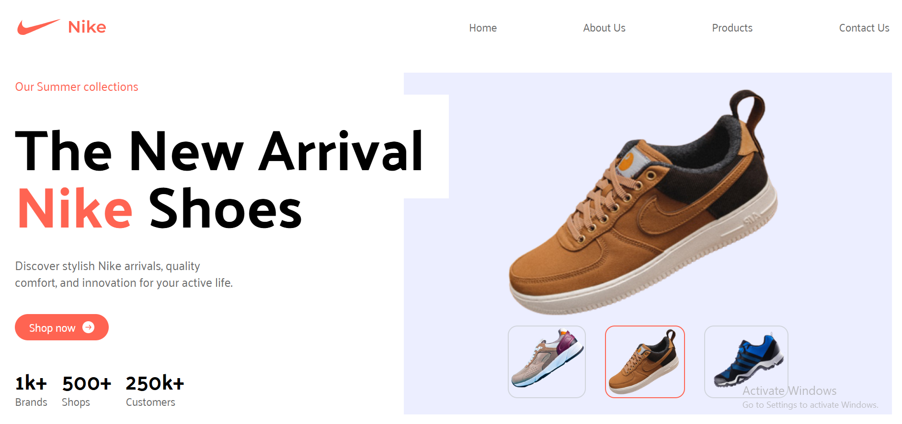

🏷️ Nike Landing Page — TailwindCSS + React

A modern, fully responsive Nike Landing Page built using React and TailwindCSS.
This project helped me sharpen my Tailwind skills, practice component-based architecture, and improve responsive UI design.

🔗 Live Demo

🚀 Live Preview: https://nike-landing-page-rabiul.vercel.app/
📂 GitHub Repo: https://github.com/rabiul7772/nike_landing_page

⭐ Features

⚡ Fully responsive across all devices
🎨 Beautiful modern UI inspired by real Nike pages
🧩 Clean React component structure
🖼️ Dynamic product image slider
🔥 TailwindCSS utilities for fast styling
🎯 Smooth layout, spacing, and visuals

🛠️ Tech Stack

React
TailwindCSS
Vite
JavaScript (ES6+)

📘 Learnings

While building this project, I improved:
Tailwind layout utilities (flex, grid, spacing)
Responsive design techniques
React component organization
Clean UI/UX structure

🙌 Acknowledgment

This project is inspired by the TailwindCSS Crash Course from JavaScript Mastery.

💬 Feedback
If you have any feedback or suggestions, feel free to reach out!
